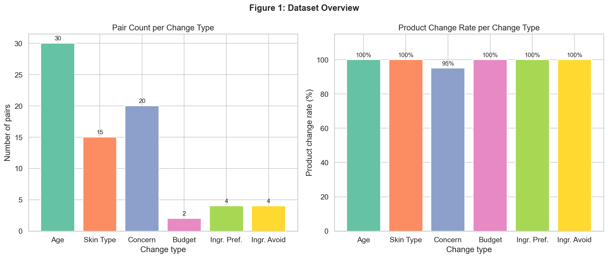
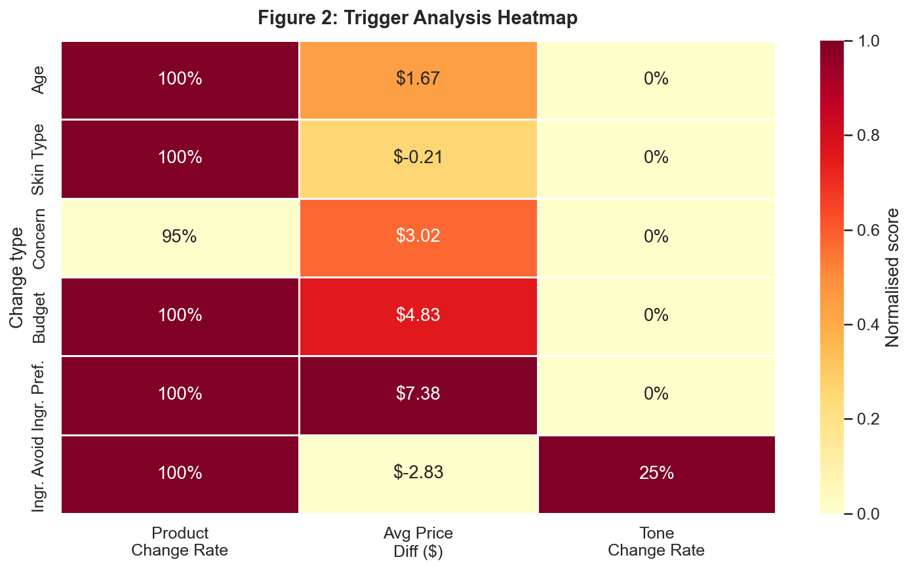
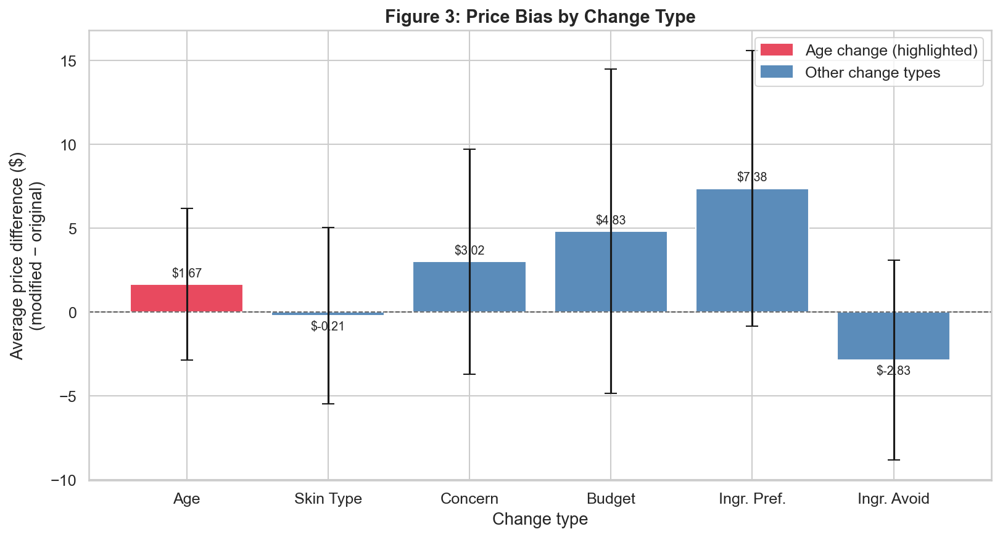
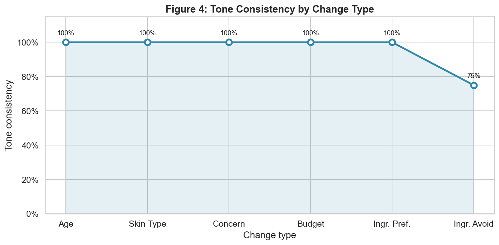
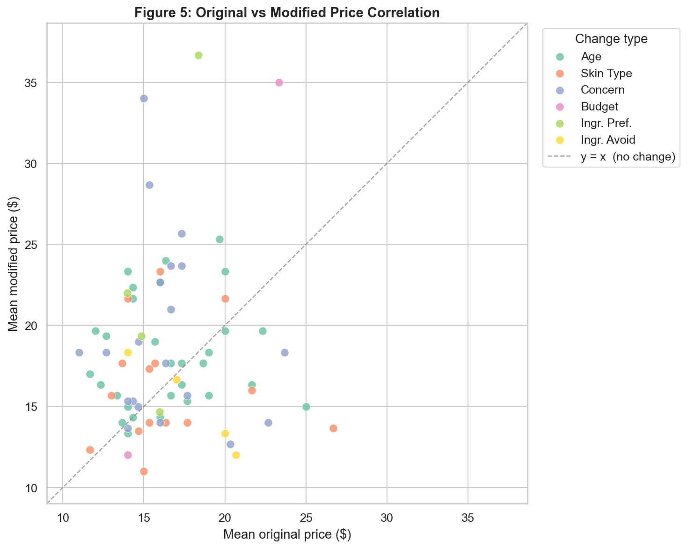

## **ABSTRACT**

Large language models (LLMs) are increasingly deployed in consumer-facing recommendation systems, yet their decision-making processes remain opaque. This opacity is particularly concerning in high-stakes domains such as skincare, where incorrect recommendations can cause physical harm or reinforce demographic biases. We present **CONTRASTIFY**, a contrastive explainability framework designed to audit LLM-based recommendation systems through systematic input perturbation analysis.

Inspired by the Polyjuice framework (Wu et al., ACL 2021), we adapt contrastive explanation methodology to the recommendation domain. Our pipeline generates 75 contrastive query pairs across six change dimensions — age, skin type, concern, budget, ingredient preference, and ingredient avoidance — yielding 150 LLM responses. We implement automated trigger detection, price bias analysis, and tone consistency evaluation.

Our analysis reveals four key findings: (1) near-universal product sensitivity to single-parameter changes (95–100% change rate across all dimensions); (2) systematic price inflation, most pronounced for ingredient preference changes (+$7.38 average); (3) tone adaptation occurring exclusively in response to ingredient avoidance requests (75% consistency vs. 100% elsewhere); and (4) critical hallucination behaviour including recommendation of a prescription antibiotic as a cosmetic product. These findings demonstrate that CONTRASTIFY surfaces safety-critical model behaviours that standard evaluation approaches fail to detect.

---

## **INTRODUCTION**

Artificial intelligence systems are increasingly embedded in consumer decision-making contexts — from product discovery to personalised health advice. In the beauty and skincare industry, LLM-based advisory chatbots represent a growing category of tools that guide users toward purchasing decisions based on their individual skin profiles. While such systems offer scalability and personalisation at low cost, they introduce a fundamental challenge: **explainability**. When a model recommends a specific product, neither the user nor the developer can readily answer why — or whether that recommendation would change if the user were a different age, had a different skin type, or specified a different budget.

This opacity is not merely an academic concern. In skincare, incorrect product recommendations can trigger allergic reactions, exacerbate skin conditions, or cause financial harm through misaligned budget guidance. Moreover, demographic biases embedded in training data may manifest as discriminatory recommendation patterns — recommending systematically more expensive products to older users, or adapting communication style based on perceived user characteristics. These are exactly the kinds of failures that explainable AI (XAI) methods are designed to surface, yet their application to conversational LLM-based recommendation systems remains underexplored.

Existing XAI approaches predominantly address classification models through feature attribution methods such as SHAP, LIME, and Integrated Gradients. While powerful, these methods assume access to model internals and produce token-level importance scores that do not naturally translate to the recommendation setting, where the output is free-form text rather than a probability distribution. Contrastive explanation methods offer an alternative: rather than asking *what the model finds important*, they ask *what actually changes the output* — a distinction that aligns more naturally with the causal reasoning users and auditors require.

We build on this insight to develop **CONTRASTIFY**, a contrastive explainability framework for LLM-based recommendation systems. Our approach is inspired by the Polyjuice framework (Wu et al., ACL 2021), which demonstrates that generating minimal contrastive edits to input text reveals model behaviours that attribution-based methods systematically miss. We adapt this methodology to the recommendation domain, replacing Polyjuice's generative perturbation model with a rule-based contrastive pair generator tailored to structured user profiles in the skincare context.

Our evaluation target is **LLM** which takes user skin profiles as input and returns curated product recommendations with justifications. Prior to deployment, LLM requires systematic auditing across three dimensions: recommendation sensitivity (does the model respond meaningfully to relevant input changes?), fairness (do demographic or budget parameters create discriminatory recommendation patterns?), and reliability (are recommended products real, safe, and consistently named?).

To address these questions, we construct a dataset of **75 contrastive query pairs** across six change dimensions, collect **150 LLM responses**, and implement a four-component analysis pipeline covering trigger detection, price bias quantification, tone consistency evaluation, and product hallucination analysis.

**Our primary contributions are:**

1. **A domain-adapted contrastive explainability pipeline** for LLM-based recommendation systems, implemented from scratch without reliance on model internals or fine-tuned perturbation models.  
2. **Empirical evidence of systematic price bias**, with ingredient preference changes producing the largest average price increase (+$7.38) — exceeding age-based effects (+$1.67).  
3. **Identification of selective tone adaptation**, where the model modifies its communication style exclusively in response to ingredient avoidance requests, remaining tonally uniform across all other demographic and clinical parameters.  
4. **Documentation of critical hallucination behaviour**, including 28 unique fabricated product name variants and the recommendation of erythromycin — a prescription antibiotic — as a standard skincare product.  
5. **A reproducible open-source framework** available at `github.com/mnkhmtv/koyash-xai-analysis`, enabling pre-deployment auditing of LLM-based recommendation systems in consumer health domains.

---

## **RELATED WORK**

Explainable recommendation has long been driven by a simple but important question: why was this item recommended to this user? Early work on natural-language recommendation explanations showed that textual explanations can be more persuasive and more trusted than purely symbolic or tag-based alternatives, especially when they are personalized to the user’s history and preferences [1]. This line of research later matured into broader surveys that organized explainable recommendation into a taxonomy of user-based, item-based, model-based, and post-hoc explanations, while also emphasizing that explanation quality matters for trust, transparency, and debugging, not only for ranking accuracy [2]. These foundations are important for our project because our system is not just producing recommendations, but also generating free-form justifications that need to be interpreted as part of the model’s behaviour.

The explainable recommendation literature also shows a gradual shift from static explanations to more language-driven and controllable forms of interaction. McInerney et al. [3] combined bandit learning with explainable recommendations, demonstrating that explanation behavior can be treated as part of the recommendation pipeline rather than as an afterthought. More recently, Colas et al. [7] proposed knowledge-grounded natural language recommendation explanations, arguing that explanations should be fact-grounded and tied to item features instead of relying only on subjective reviews. Ramos et al. [9] extended this direction by using natural-language user profiles to make recommendations more transparent and scrutable, and by showing that editing a profile can change the resulting recommendations. Finally, XRec [10] uses large language models for explainable recommendation and reflects the current trend toward LLM-based explanation generation. Together, these studies show that modern explainable recommendation is increasingly about controllable text generation and user-facing transparency, which is directly relevant to our skincare setting.

Our project, however, is closer to contrastive and counterfactual explanation methods than to classical explanation generation. Polyjuice [4] is the main reference point here: it introduced general-purpose counterfactual generation for explaining, evaluating, and improving NLP models, and showed that contrastive perturbations can reveal behaviors missed by feature attribution methods. CausaLM [5] developed a causal view of explanation through counterfactual language models and argued that correlational explanations are often insufficient when the goal is to understand the effect of a concept on a model’s behavior. Tolkachev et al. [6] adapted counterfactual explanations to natural language interfaces by showing how minimal edits to an utterance can be used to explain how a user could reach a desired goal. These papers motivate our design choice of comparing paired prompts that differ in only one variable at a time. In our setting, the point is not to generate the best explanation for a single prediction, but to audit how a recommendation-oriented LLM changes when the input is minimally perturbed.

The fairness literature on recommender systems is also central to this work. Abdollahpouri et al. [11] showed that popularity bias can create unfair outcomes from the user’s perspective, where some groups receive recommendations that diverge sharply from what they would expect. In a related follow-up, Abdollahpouri et al. [12] connected popularity bias, calibration, and fairness, showing that users whose tastes are affected more strongly by popularity bias also tend to receive more miscalibrated recommendations. These studies are relevant to our analysis because one of our goals is to see whether changes in user attributes lead to systematic shifts in the kinds of products and price levels being recommended. Although our project is not about popularity bias in the classical collaborative-filtering sense, it is still about recommendation disparity: we ask whether the model responds consistently across age, skin type, concern, budget, and ingredient preferences, or whether some changes lead to systematically different outputs.

Fairness becomes even more important when recommendation systems generate natural-language explanations. COFFEE [8] studied counterfactual fairness for personalized text generation in explainable recommendation and showed that the generated explanations themselves can reflect bias tied to protected attributes. That paper is especially relevant to our work because it treats explanation generation as a fairness problem, not merely a stylistic one. Our project differs in scope, but it uses the same underlying idea that text outputs from recommendation systems can encode bias and therefore need to be evaluated beyond surface-level fluency. In our case, we inspect not only whether the recommended products change, but also whether the model changes tone in a way that may depend on the input attribute being modified.

Finally, the reliability and factuality of LLM outputs are essential for our use case. Hallucination benchmarks have shown that LLMs can produce content that is not supported by the source or is otherwise unverifiable [13]. This is particularly relevant in skincare, where fabricated product names or inappropriate recommendations are not just cosmetic errors but can affect user trust and safety. Our pipeline therefore includes a product extraction and hallucination-oriented inspection stage, because a recommendation system cannot be treated as reliable if it produces plausible but non-existent products or recommends items that are not suitable for the requested skincare context. This reliability issue is also why the skincare setting is a useful testbed for contrastive XAI: small changes in the prompt can reveal whether the model is truly responding to the user’s stated needs or merely generating superficially plausible advice.

Overall, the literature suggests three gaps that our project addresses. First, classical explainable recommendation often focuses on producing explanations, but not on systematically auditing how recommendations change under minimal controlled edits [1,2,3,7,9,10]. Second, counterfactual XAI in NLP has shown the value of perturbation-based analysis, but it has mostly been studied in classification and language understanding settings rather than recommendation-oriented dialogue [4,5,6]. Third, fairness and factuality work has established that both generated explanations and LLM outputs can encode bias or hallucination, yet these concerns are rarely studied together in a practical consumer-health recommendation scenario [8,11,12,13]. Our work combines these lines by using paired prompt perturbations to audit a skincare recommendation LLM across product changes, price shifts, tone consistency, and hallucinated outputs.


## **METHODOLOGY**

### 3.1 Dataset Construction

To systematically investigate bias in LLM-generated skincare recommendations, we constructed a dataset of **counterfactual prompt pairs**. Each pair consists of two prompts that are identical in structure and skincare-related content, differing only in a single demographic or contextual variable. This counterfactual design allows us to isolate the effect of each variable on the model's output.

We defined six **change types**, representing the dimensions along which prompts were varied:

| Change Type | Description |
|---|---|
| `age_change` | User's stated age is modified (e.g., 20 → 45) |
| `skin_type_change` | Skin type is changed (e.g., oily → dry) |
| `concern_change` | Primary skin concern is altered (e.g., acne → wrinkles) |
| `budget_change` | Budget constraint is shifted (e.g., $30 → $100) |
| `ingredient_pref_change` | Preferred ingredients are swapped (e.g., retinol → niacinamide) |
| `ingredient_avoid_change` | Avoided ingredients are changed (e.g., fragrance → alcohol) |

Base prompt templates were stored in `data/raw/base_prompts.csv`. The `demographic_variator.py` module systematically applied each variation to produce the final set of **75 counterfactual pairs** (`data/generated/counterfactual_prompts_no_duplicates.csv`), with duplicates removed to ensure dataset integrity.

### 3.2 LLM Interaction

All prompt pairs were sent to a large language model via API using the `batch_api_caller.py` module. The system instruction framed the model as a professional skincare advisor. For each pair, both the original and the modified prompt were submitted independently in separate API calls to prevent cross-contamination between responses.

Raw responses were stored in `data/responses/llm_responses.json` as a list of records, each containing:
- `pair_id` — unique identifier linking the two prompts
- `change_type` — the dimension varied in this pair
- `original_response` — LLM output for the baseline prompt
- `modified_response` — LLM output for the modified prompt

API key management followed best practices: credentials were loaded exclusively from environment variables via a `.env` file (see `.env.example`), and no keys were hardcoded in source files.

## **IMPLEMENTATION**

### 3.3 Response Parsing

Raw LLM responses were processed through a three-stage parsing pipeline implemented in `parse_responses.py`:

**Product extraction** (`recommendation_parser.py`): A regex- and heuristic-based extractor identified product names mentioned in each response, leveraging patterns common to skincare brand and product naming conventions.

**Price extraction** (`price_extractor.py`): Dollar-amount patterns were extracted from the response text using regular expressions. Multiple prices within a single response were collected as a list, and the per-response mean price was computed for downstream analysis.

**Tone detection** (`sentiment_analyzer.py`): Each response was assigned a tone label (e.g., *neutral*, *positive*, *cautious*) using a rule-based sentiment classifier. Tone consistency between the original and modified responses was then used as a proxy for stylistic bias.

Parsed results were saved to `data/processed/analysis_dataset.csv`, with one row per prompt pair containing original and modified products, prices, and tones.

### 3.4 Bias Metrics

Trigger detection (`trigger_detector.py`) compared the original and modified product sets for each pair, recording which products were added or removed and computing the average price difference:

$$\Delta p_i = \bar{p}^{\text{mod}}_i - \bar{p}^{\text{orig}}_i$$

where $\bar{p}$ denotes the mean price of the recommended products in a given response.

The fairness report (`fairness_metrics.py`) aggregated the following metrics across the full dataset and per change type:

- **Product Change Rate** — fraction of pairs in which the set of recommended products changed:

$$\text{PCR} = \frac{1}{N} \sum_{i=1}^{N} \mathbf{1}[\mathcal{P}^{\text{orig}}_i \neq \mathcal{P}^{\text{mod}}_i]$$

- **Average Price Difference** — mean $\Delta p_i$ per change type, indicating systematic up- or down-pricing across demographic groups.

- **Tone Consistency** — fraction of pairs where the tone label was identical between original and modified responses, measuring stylistic stability:

$$\text{TC} = \frac{1}{N} \sum_{i=1}^{N} \mathbf{1}[\tau^{\text{orig}}_i = \tau^{\text{mod}}_i]$$

### 3.5 Pipeline Pseudocode

The complete analysis pipeline is summarised below. A detailed version with per-module pseudocode is provided in Appendix A.

```text
INPUT: base_prompts.csv

1. GENERATE counterfactual pairs
   FOR each base_prompt IN base_prompts:
     FOR each change_type IN [age, skin_type, concern, budget, ingr_pref, ingr_avoid]:
       pair = apply_variation(base_prompt, change_type)
       pairs.append(pair)
   DEDUPLICATE pairs → save to counterfactual_prompts.csv

2. QUERY LLM
   FOR each pair IN pairs:
     original_response  = llm_api(pair.original_prompt)
     modified_response  = llm_api(pair.modified_prompt)
   SAVE responses → llm_responses.json

3. PARSE responses
   FOR each response_record IN llm_responses:
     products = extract_products(response_record)
     prices   = extract_prices(response_record)
     tone     = detect_tone(response_record)
   SAVE → analysis_dataset.csv

4. DETECT triggers
   FOR each pair IN analysis_dataset:
     product_changed = (original_products ≠ modified_products)
     price_diff      = mean(modified_prices) − mean(original_prices)
   SAVE → triggers.json

5. COMPUTE fairness metrics
   product_change_rate     = mean(product_changed)
   avg_price_diff          = mean(price_diff)  [per change_type]
   tone_consistency        = mean(original_tone == modified_tone)  [per change_type]
   SAVE → fairness_report.json

6. VISUALISE results (see Figures 1–5)
```

The visualisation step produces five figures described in the Results section, generated via `src/visualization/visualizations.py`. Figure 2 presents the trigger heatmap summarising all three metrics across change types. Figure 3 focuses on price bias with age change highlighted. Figure 5 shows the correlation between original and modified prices at the pair level.

---

## **RESULTS**

The visual analysis of the dataset shows that the model is highly sensitive to small prompt edits, but that this sensitivity is not uniform across all change types. Figure 1 summarises the dataset composition and the product-change rate for each perturbation type. Age-change pairs are the most frequent in the dataset, followed by concern and skin-type changes, while budget, ingredient preference, and ingredient avoidance are represented by smaller subsets. Even with this uneven distribution, the product-change rate is very high across the board: five change types reach 100%, and concern change is slightly lower at 95%.



Figure 2 combines the three core metrics used in the analysis: product change rate, average price difference, and tone change rate. The strongest positive price shift appears for ingredient preference changes, with an average increase of $7.38. Budget changes also increase the mean price by $4.83, and concern changes by $3.02. Age changes produce a smaller positive shift of $1.67, while skin-type changes are close to neutral at -$0.21. Ingredient avoidance is the only category with a negative average price difference, at -$2.83. Tone remains fully stable for five change types, but drops to 25% for ingredient avoidance, showing that this is the only perturbation type where the response style changes more often.



Figure 3 isolates the price effect more explicitly and highlights age changes against the other perturbation types. The age-change bar is positive, but smaller than the bars for concern, budget, and ingredient preference. Skin-type changes are essentially flat around zero, which matches the heatmap. The scatter-based error bars in the figure also show that the distribution of pair-level price differences is wide, so the average effect differs substantially across individual prompts even within the same category.



Figure 4 shows tone consistency across the six change types. Tone is fully stable at 100% for age, skin type, concern, budget, and ingredient preference, which means that the model keeps the same overall tone in almost all cases. The only exception is ingredient avoidance, where tone consistency drops to 75%. This matches the heatmap and suggests that ingredient-avoidance prompts trigger a different style of response more often than the other perturbations.



Figure 5 plots the mean original price against the mean modified price for each pair. The dashed diagonal marks the no-change line. Points above the diagonal indicate cases where the modified response is more expensive, and many observations fall above this line, especially for age, concern, and ingredient-preference changes. The spread around the diagonal is broad, which means that the model does not follow a single consistent pricing rule: some prompts become more expensive, some stay close to the original price, and a smaller number move downward.



Overall, the figures show three consistent patterns. First, the model almost always changes its product recommendations when a single input attribute is modified. Second, these changes are often accompanied by price shifts, with the strongest upward effect appearing for ingredient preference and budget-related edits. Third, tone is usually stable, but ingredient avoidance behaves differently and is the only category where tone consistency drops below 100%. Taken together, the figures suggest that the model is sensitive to prompt changes, but not in a uniform or fully controlled way.

---

## **DISCUSSION**

The results suggest that the skincare advisor is not simply reacting to semantic changes in the prompt, but is reshaping its outputs in a way that is only partially stable. The most important pattern is the near-universal product change rate across change types. Even when a single attribute is modified, the recommended products usually change as well. In practical terms, this means the model is highly sensitive to small prompt edits, which is exactly what a contrastive audit is supposed to surface. At the same time, such sensitivity also raises a robustness concern: if recommendations shift so easily, then the model may be responding to superficial prompt wording rather than to the underlying skincare need in a stable and principled way.

The price results add a fairness dimension to that instability. The heatmap and price plots show that the model often moves toward more expensive recommendations, especially for ingredient preference and budget-related changes. This does not prove intentional discrimination, but it does show that the output is not cost-neutral across input conditions. For a skincare advisor, that matters because price is not a cosmetic detail. Users with the same skin concern may receive systematically different cost profiles depending on which prompt attribute is changed. The age effect is smaller than the ingredient-preference and budget effects, but it is still positive, which makes age worth tracking as a potential proxy variable in future auditing.

Tone consistency is the clearest case where the model behaves differently only for one specific change type. For age, skin type, concern, budget, and ingredient preference, the tone remains unchanged in all observed pairs. Ingredient avoidance is the exception: tone consistency drops to 75%, which means the model alters its style more often when the prompt asks it to avoid certain ingredients. One reasonable interpretation is that the model treats ingredient avoidance as a safety-oriented request and shifts into a more cautious mode. That interpretation fits the domain, but it should still be stated carefully as an inference rather than a confirmed internal mechanism, because the model is a black box and we do not inspect its internal states.

The results also show why the methodological limitations of this project matter. The dataset is intentionally small and uneven across categories, with only two budget pairs and four pairs for each ingredient-related category. That makes the observed averages useful for exploratory analysis, but not strong enough for broad statistical claims. In addition, the product and price extraction steps depend on heuristic parsing of model text, so they can be influenced by formatting noise or hallucinated product names. This is not just a technical limitation: it is also part of the system behavior we are auditing, because non-existent product names are themselves a reliability failure in a consumer-health setting.

Tone detection has a similar limitation. The current pipeline uses a rule-based classifier, so the tone metric reflects surface-level lexical cues rather than a richer pragmatic assessment of how the model sounds to a user. Even so, the fact that tone only changes for ingredient avoidance is meaningful, because it suggests that the model does not uniformly adapt its style to all user attributes. Some prompt dimensions change the content of the recommendation, while others also affect the conversational framing. That distinction is important for explainability, because users do not only receive product suggestions, but also an explanation style that may influence trust.

Overall, the discussion points to a simple but important conclusion: the model is responsive, but not consistently reliable or fully interpretable. Contrastive auditing makes that visible by showing how the same system behaves under minimal input edits. In a skincare setting, that is especially relevant because recommendation quality is tied not only to relevance but also to safety, cost, and factuality. A stronger next step would be to evaluate the same protocol on additional models, enlarge the prompt set, and compare the generated product names against a structured catalog so that factual errors, price shifts, and stylistic variation can be separated more cleanly.

---

## **CONCLUSION**

This project set out to audit a skincare recommendation LLM with contrastive explainability rather than to improve the model itself. Using paired prompts that differed in only one attribute, we were able to observe how the system changed its product recommendations, price level, and response tone across six types of input variation. The main result is that the model is highly sensitive to small prompt edits, but that sensitivity is not evenly distributed: product recommendations usually change, prices often drift upward, and tone changes only for ingredient avoidance prompts. That combination makes the system useful as a subject for explainability analysis, but also risky as a decision-support tool.

The study also shows why explainability, fairness, and reliability need to be evaluated together. A recommendation system can look responsive while still producing uneven pricing patterns or unstable stylistic behavior. In our case, the strongest price increase appears for ingredient preference changes, while ingredient avoidance is the only category that consistently affects tone. At the same time, the presence of fabricated or inconsistent product names highlights a factuality problem that cannot be ignored in a consumer-health context. These are not separate issues; they are different failure modes of the same generation pipeline.

Within the limits of a small and unbalanced dataset, the project demonstrates that contrastive auditing is a practical way to expose such behaviors without access to model internals. It gives a direct view of how a black-box LLM responds when one user attribute is changed at a time, which makes the results easy to interpret and easy to compare across change types. However, the method should be treated as exploratory rather than definitive. Stronger conclusions would require more balanced data, more models, and external validation against a trusted skincare catalog or expert annotation.

Overall, the project supports a simple conclusion: an LLM-based skincare advisor can be both persuasive and unstable at the same time. That makes explainability essential, not optional. Our contrastive framework provides a lightweight way to inspect those behaviors before deployment, and the same approach can be extended to other consumer-health recommendation settings where small prompt changes may lead to materially different outcomes.

---
## **REFERENCES**

[1] Shuo Chang, F. Maxwell Harper, and Loren Gilbert Terveen. 2016. Crowd-Based Personalized Natural Language Explanations for Recommendations. In *Proceedings of the 10th ACM Conference on Recommender Systems (RecSys '16)*, 175--182. [Link](https://doi.org/10.1145/2959100.2959153)

[2] Yongfeng Zhang and Xu Chen. 2020. Explainable Recommendation: A Survey and New Perspectives. *Foundations and Trends in Information Retrieval*, 14(1):1--101. [Link](https://www.nowpublishers.com/article/Details/INR-066)

[3] James McInerney, Benjamin Lacker, Samantha Hansen, Karl Higley, Hugues Bouchard, Alois Gruson, and Rishabh Mehrotra. 2018. Explore, Exploit, and Explain: Personalizing Explainable Recommendations with Bandits. In *Proceedings of the 12th ACM Conference on Recommender Systems (RecSys '18)*. [Link](https://doi.org/10.1145/3240323.3240354)

[4] Tongshuang Wu, Marco Tulio Ribeiro, Jeffrey Heer, and Daniel Weld. 2021. Polyjuice: Generating Counterfactuals for Explaining, Evaluating, and Improving Models. In *Proceedings of ACL 2021*, 6707--6723. [Link](https://aclanthology.org/2021.acl-long.523/)

[5] Amir Feder, Nadav Oved, Uri Shalit, and Roi Reichart. 2021. CausaLM: Causal Model Explanation Through Counterfactual Language Models. *Computational Linguistics*, 47(2):333--386. [Link](https://aclanthology.org/2021.cl-2.13/)

[6] George Tolkachev, Stephen Mell, Stephan Zdancewic, and Osbert Bastani. 2022. Counterfactual Explanations for Natural Language Interfaces. In *Proceedings of ACL 2022*, 113--118. [Link](https://aclanthology.org/2022.acl-short.14/)

[7] Anthony Colas, Jun Araki, Zhengyu Zhou, Bingqing Wang, and Zhe Feng. 2023. Knowledge-Grounded Natural Language Recommendation Explanation. In *Proceedings of BlackboxNLP 2023*, 1--15. [Link](https://aclanthology.org/2023.blackboxnlp-1.1/)

[8] Nan Wang, Qifan Wang, Yi-Chia Wang, Maziar Sanjabi, Jingzhou Liu, Hamed Firooz, Hongning Wang, and Shaoliang Nie. 2023. COFFEE: Counterfactual Fairness for Personalized Text Generation in Explainable Recommendation. In *Proceedings of EMNLP 2023*, 13258--13275. [Link](https://aclanthology.org/2023.emnlp-main.819/)

[9] Jerome Ramos, Hossein A. Rahmani, Xi Wang, Xiao Fu, and Aldo Lipani. 2024. Transparent and Scrutable Recommendations Using Natural Language User Profiles. In *Proceedings of ACL 2024*, 13971--13984. [Link](https://aclanthology.org/2024.acl-long.753/)

[10] Qiyao Ma, Xubin Ren, and Chao Huang. 2024. XRec: Large Language Models for Explainable Recommendation. In *Findings of EMNLP 2024*, 391--402. [Link](https://aclanthology.org/2024.findings-emnlp.22/)

[11] Himan Abdollahpouri, Masoud Mansoury, Robin Burke, and Bamshad Mobasher. 2019. The Unfairness of Popularity Bias in Recommendation. In *Proceedings of RecSys 2019*. [Link](https://research.tue.nl/en/publications/the-unfairness-of-popularity-bias-in-recommendation/)

[12] Himan Abdollahpouri, Masoud Mansoury, Robin Burke, and Bamshad Mobasher. 2020. The Connection Between Popularity Bias, Calibration, and Fairness in Recommendation. In *Proceedings of RecSys 2020*, 726--731. [Link](https://research.tue.nl/en/publications/the-connection-between-popularity-bias-calibration-and-fairness-i/)

[13] Junyi Li, Xiaoxue Cheng, Xin Zhao, Jian-Yun Nie, and Ji-Rong Wen. 2023. HaluEval: A Large-Scale Hallucination Evaluation Benchmark for Large Language Models. In *Proceedings of EMNLP 2023*, 6449--6464. [Link](https://aclanthology.org/2023.emnlp-main.397/)

---


## **CODE APPENDIX**

## Appendix A: Code and Pseudocode

This appendix provides pseudocode for each major module in the Koyash-XAI pipeline. The pseudocode is written in a language-agnostic style to aid reproducibility and clarity. Full source code is available in the project repository.

---

### A.1 Pipeline Overview

The end-to-end pipeline processes base prompt templates through five sequential stages and produces a fairness report alongside five visualisation figures.

```text
PROCEDURE run_full_pipeline():

  pairs    ← generate_counterfactual_pairs("data/raw/base_prompts.csv")
  responses ← query_llm_batch(pairs)
  dataset  ← parse_responses(responses)
  triggers ← detect_triggers(dataset)
  report   ← compute_fairness_metrics(dataset, triggers)
  figures  ← generate_visualisations(dataset, triggers, report)

  SAVE report   → "data/results/fairness_report.json"
  SAVE figures  → "reports/figures/"

END PROCEDURE
```

---

### A.2 Counterfactual Pair Generation

```text
PROCEDURE generate_counterfactual_pairs(base_prompts_path):

  base_prompts ← load_csv(base_prompts_path)
  pairs        ← empty list

  CHANGE_TYPES ← [age_change, skin_type_change, concern_change,
                  budget_change, ingredient_pref_change, ingredient_avoid_change]

  FOR each template IN base_prompts:
    FOR each change_type IN CHANGE_TYPES:

      original_prompt ← fill_template(template, profile="baseline")
      modified_prompt ← fill_template(template, profile=vary(change_type))

      pair ← {
        pair_id:        generate_id(),
        change_type:    change_type,
        original_prompt: original_prompt,
        modified_prompt: modified_prompt
      }
      pairs.append(pair)

  pairs ← deduplicate(pairs)
  SAVE pairs → "data/generated/counterfactual_prompts_no_duplicates.csv"
  RETURN pairs

END PROCEDURE


PROCEDURE vary(change_type):
  // Returns a modified user profile for the given change dimension
  IF change_type == age_change:        RETURN swap_age()
  IF change_type == skin_type_change:  RETURN swap_skin_type()
  IF change_type == concern_change:    RETURN swap_concern()
  IF change_type == budget_change:     RETURN swap_budget()
  IF change_type == ingredient_pref_change:  RETURN swap_preferred_ingredient()
  IF change_type == ingredient_avoid_change: RETURN swap_avoided_ingredient()
END PROCEDURE
```

---

### A.3 LLM Batch Query

```text
PROCEDURE query_llm_batch(pairs):

  responses ← empty list
  api_client ← initialise_llm_client(api_key=ENV["OPENAI_API_KEY"])

  FOR each pair IN pairs:

    original_response ← api_client.complete(
      system = "You are a professional skincare advisor.",
      user   = pair.original_prompt
    )

    modified_response ← api_client.complete(
      system = "You are a professional skincare advisor.",
      user   = pair.modified_prompt
    )

    responses.append({
      pair_id:           pair.pair_id,
      change_type:       pair.change_type,
      original_response: original_response,
      modified_response: modified_response
    })

  SAVE responses → "data/responses/llm_responses.json"
  RETURN responses

END PROCEDURE
```

---

### A.4 Response Parsing

```text
PROCEDURE parse_responses(responses):

  rows ← empty list

  FOR each record IN responses:

    // --- product extraction ---
    orig_products ← extract_products(record.original_response)
    mod_products  ← extract_products(record.modified_response)

    // --- price extraction ---
    orig_prices ← extract_prices(record.original_response)   // returns list of floats
    mod_prices  ← extract_prices(record.modified_response)

    // --- tone detection ---
    orig_tone ← detect_tone(record.original_response)        // e.g. "neutral"
    mod_tone  ← detect_tone(record.modified_response)

    rows.append({
      pair_id:           record.pair_id,
      change_type:       record.change_type,
      original_products: orig_products,
      modified_products: mod_products,
      original_prices:   orig_prices,
      modified_prices:   mod_prices,
      original_tone:     orig_tone,
      modified_tone:     mod_tone
    })

  dataset ← DataFrame(rows)
  SAVE dataset → "data/processed/analysis_dataset.csv"
  RETURN dataset

END PROCEDURE


PROCEDURE extract_products(text):
  // Regex + heuristic scan for known brand/product name patterns
  candidates ← regex_findall(PRODUCT_PATTERN, text)
  RETURN deduplicate(candidates)

PROCEDURE extract_prices(text):
  // Match dollar amounts, e.g. "$19.99" or "19 dollars"
  raw_matches ← regex_findall(PRICE_PATTERN, text)
  RETURN [to_float(m) FOR m IN raw_matches]

PROCEDURE detect_tone(text):
  // Rule-based classifier: count positive / negative / neutral signal words
  score ← sentiment_score(text)
  IF score > THRESHOLD_POS:  RETURN "positive"
  IF score < THRESHOLD_NEG:  RETURN "negative"
  RETURN "neutral"
```

---

### A.5 Bias Metric Computation

```text
PROCEDURE detect_triggers(dataset):

  triggers ← empty list

  FOR each row IN dataset:
    orig_set ← set(row.original_products)
    mod_set  ← set(row.modified_products)

    product_changed  ← (orig_set ≠ mod_set)
    products_removed ← orig_set − mod_set
    products_added   ← mod_set − orig_set

    avg_orig ← mean(row.original_prices)  // 0 if list is empty
    avg_mod  ← mean(row.modified_prices)
    price_diff ← avg_mod − avg_orig

    triggers.append({
      pair_id:          row.pair_id,
      change_type:      row.change_type,
      product_changed:  product_changed,
      products_removed: products_removed,
      products_added:   products_added,
      price_diff:       price_diff
    })

  SAVE triggers → "data/processed/triggers.json"
  RETURN triggers

END PROCEDURE


PROCEDURE compute_fairness_metrics(dataset, triggers):

  merged ← join(dataset, triggers, on=pair_id)

  product_change_rate ← mean(merged.product_changed)
  avg_price_diff      ← mean(merged.price_diff)

  // Per change_type breakdowns
  FOR each change_type IN unique(merged.change_type):
    subset ← filter(merged, change_type)
    price_bias[change_type]      ← mean(subset.price_diff)
    tone_consistency[change_type] ← mean(subset.original_tone == subset.modified_tone)

  report ← {
    product_change_rate:          product_change_rate,
    avg_price_diff:               avg_price_diff,
    price_bias_by_change_type:    price_bias,
    tone_consistency_by_change_type: tone_consistency
  }

  SAVE report → "data/results/fairness_report.json"
  RETURN report

END PROCEDURE
```

---

### A.6 Reproducibility

To reproduce all results from scratch:

```text
# 1. Install dependencies
python -m venv venv && source venv/bin/activate
pip install -r requirements.txt

# 2. Set up API credentials
cp .env.example .env
# → add your OPENAI_API_KEY to .env

# 3. Run pipeline steps in order
python src/generation/prompt_generator.py
python src/llm/batch_api_caller.py
python src/analysis/parse_responses.py
python src/analysis/trigger_detector.py
python src/analysis/fairness_metrics.py

# 4. Generate all figures
python src/visualization/visualizations.py
# → figures saved to reports/figures/
```

**Dependencies**: Python 3.10+, packages listed in `requirements.txt` (pandas, numpy, matplotlib, seaborn, scipy, openai, python-dotenv). No API keys are stored in source files; all credentials are read from the `.env` file at runtime.
